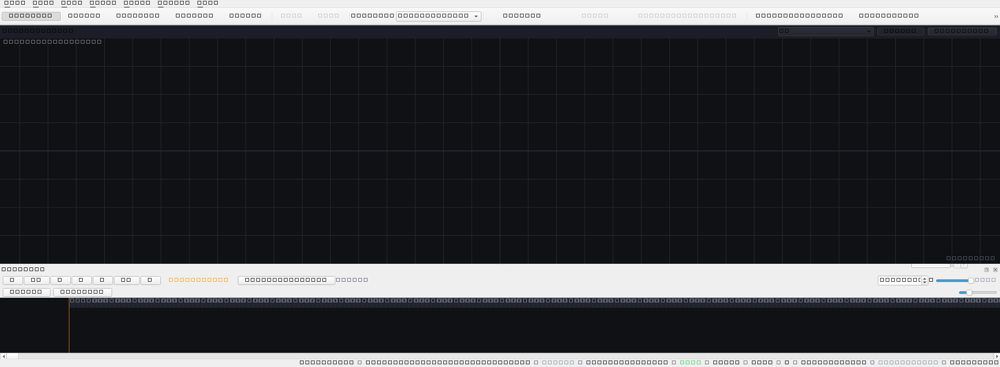

# ProjectionAI

**AI-powered projection mapping platform.**

Scan any object — a painting, sculpture, building facade, or stage — and ProjectionAI automatically estimates its geometry, detects projection surfaces, and lets you generate and warp content onto it using natural language prompts.

The long-term vision: become the "ChatGPT for Projection Mapping."

[](https://github.com/sashtriyasam/projectionai/actions/workflows/ci.yml)
[](https://www.python.org/)
[](https://docs.astral.sh/ruff/)
[](https://mypy-lang.org/)
[](LICENSE)

---

## Screenshot



The desktop shell with docked scene/asset/devices panels, the 3D viewport, and the hardware status bar.

---

## Features

- **Object Scanning** — Photograph or scan physical objects to auto-estimate geometry
- **Surface Detection** — Computer vision identifies planar and curved projection surfaces
- **AI Content Generation** — Provider-agnostic AI engine (Gemini, OpenAI, Anthropic, Replicate)
- **Projector Calibration** — Structured-light / gray-code pipeline with camera + Y estimation models and hardware validation
- **Display & Output Management** — Display topology detection, change tracking, validation gates, safe preview / live output sessions
- **Automatic Warping** — Generated content is automatically mapped onto object surfaces
- **Real-time Preview** — See exactly how projections will look before projecting
- **Multi-projector Ready** — Architecture supports future multi-projector setups
- **Undo/redo & Background Jobs** — Typed command history plus a priority job queue

---

## Quick Start

```bash
# Prerequisites: Python 3.12+, uv

# Clone and install
git clone https://github.com/sashtriyasam/projectionai.git
cd projectionai

# Create virtual environment and install all dependencies
uv sync

# Activate
.venv\Scripts\activate   # Windows
# source .venv/bin/activate  # macOS/Linux

# Configure AI provider (copy and edit)
cp .env.example .env
# Edit .env with your API keys

# Run
python -m projectionai        # or: uv run projectionai
```

The application runs without any AI provider configured — content warping, calibration, display output, and the 3D viewport all work offline. Providers are only needed for AI content generation.

---

## Development

```bash
# Install with dev dependencies
uv sync --extra dev

# Run the full test suite
pytest

# Type check (strict)
mypy src/projectionai

# Lint and format
ruff check src/
ruff format --check src/
ruff format src/           # auto-format

# Install pre-commit hooks
pre-commit install
```

### Testing

- Run everything: `pytest`
- Focus on one area: `pytest tests/unit/hardware`
- Coverage gate: `--cov-fail-under=60` (enforced by default in CI)
- Global timeout: 300s per test (pytest-timeout); tests that hang will be killed deterministically
- Markers: `slow`, `integration`, `requires_gpu`, `requires_camera`
- UI tests run headless via `QT_QPA_PLATFORM=offscreen`

### Project Structure

```
src/projectionai/               # Main package
├── core/                       # Framework: event bus, plugin system, config, errors, logging
├── domain/                     # Business models: scene, project, surface, calibration, assets, jobs, workspace
├── services/                   # Abstractions: vision, AI, renderer, calibration, display, storage
├── infrastructure/             # Implementations: AI providers, OpenCV, ModernGL, SQLite, display providers
├── application/                # Use cases: scan, generate, warp, preview, project
├── managers/                   # Concrete managers: scene, asset, project, job, plugin, settings, workspace, command, hardware
├── editor/                     # Editor subsystems: selection, gizmos, transform tools, camera, calibration overlay
├── calibration/                # Projector & camera calibration: stages, models, pipeline, validation, export
├── hardware/                   # Display hardware: topology, watcher, validator, output sessions
├── ui/                         # PySide6 shell: main window, panels, viewmodels, views, widgets, theme
├── app.py                      # Application bootstrap / DI container
└── main.py                     # CLI entry point
```

### Architecture

```
┌─────────────────────────────────────────────────────────────┐
│                          UI (PySide6)                        │
│  Views ↔ ViewModels ↔ Panels ↔ Status bar  (MVVM)            │
└───────────────┬───────────────────────────────┬──────────────┘
                │                               │
┌───────────────▼───────────────┐   ┌───────────▼──────────────┐
│         Application            │   │        managers/          │
│   use-case orchestrators       │   │ Settings · Plugin ·      │
│   (scan / generate / warp /    │   │ Command · Scene · Asset ·│
│    preview / project)          │   │ Job · Project · Hardware │
└───────────────┬───────────────┘   └───────────▲──────────────┘
                │                               │
┌───────────────▼───────────────────────────────┴──────────────┐
│                  Event Bus (typed, async)                     │
└───────────────▲───────────────────────────────┬──────────────┘
                │                               │
┌───────────────┴───────────────┐   ┌───────────▼──────────────┐
│        Domain models           │   │          Services         │
│   (pure Python, no deps)      │   │  (interfaces/Protocols)   │
└───────────────┬───────────────┘   └───────────▲──────────────┘
                │                               │
                └─────────── Infrastructure ────┘
        (AI providers · OpenCV · ModernGL · SQLite · Display)
```

See [docs/Architecture.md](docs/Architecture.md) for a detailed walkthrough, [docs/ADR/](docs/ADR/) for architecture decision records (12 ADRs), and [docs/UX-ARCHITECTURE.md](docs/UX-ARCHITECTURE.md) for the desktop UX design.

### Coding Standards

- **Type safety** — `strict` mypy is enforced; never silence errors with `# type: ignore`
- **Linting** — `ruff` with `E/W/F/I/N/UP/B/SIM/ARG/RUF` rulesets (see `pyproject.toml`)
- **Formatting** — `ruff format` (double-quoted, black-compatible line length 88)
- **Errors** — recoverable failures use the typed `ProjectionAIError` hierarchy; no bare `except:`
- **Testing** — test-driven development, use the fixtures in `tests/fixtures/`, headless Qt via `offscreen`

See [CONTRIBUTING.md](CONTRIBUTING.md) for the full contributor workflow.

### Layers & Dependencies Between Modules

The codebase follows **Clean Architecture** with a strictly one-way dependency direction: `UI → Application → Domain`, with domain consuming only service interfaces that infrastructure implementations provide. See [ADR-007](docs/ADR/007-domain-package-structure.md) for details.

---

## Project Status

Current development version: **v0.1.0.dev0** — see the [Roadmap](ROADMAP.md) for milestone tracking and [CHANGELOG.md](CHANGELOG.md) for release notes.

Because display hardware and projections are hard to ship in CI, the codebase is exercised with deterministic mock providers; see `docs/HARDWARE-VALIDATION.md` and `docs/OUTPUT.md` for the display output contracts and validation gates.

**Hardware validation** (Phase 7.15) requires a physical camera, projector, and projection surface. These gates are currently HARDWARE_PENDING — see [docs/HARDWARE-VALIDATION.md](docs/HARDWARE-VALIDATION.md) for the test harness and readiness checklist.

---

## Contributing

Contributions are welcome — see [CONTRIBUTING.md](CONTRIBUTING.md) for the setup, code style, testing, and PR workflow. Please read the [Code of Conduct](CODE_OF_CONDUCT.md) as well.

### Security

If you find a security vulnerability, please follow the process in [SECURITY.md](SECURITY.md) (do not open a public issue).

---

## License

Licensed under the [MIT License](LICENSE).
