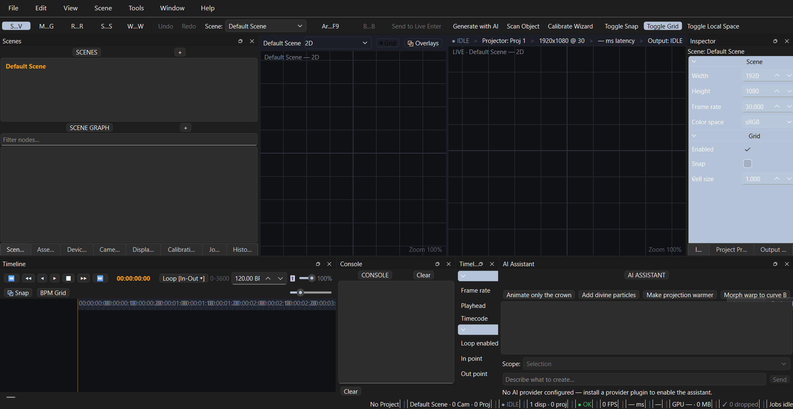
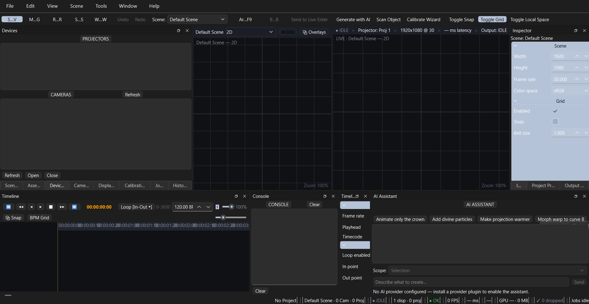
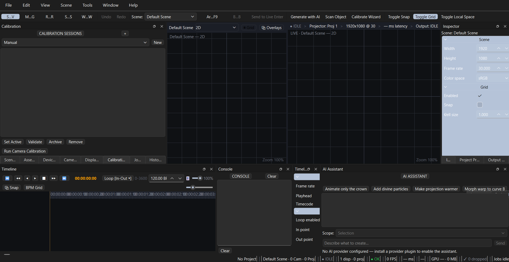
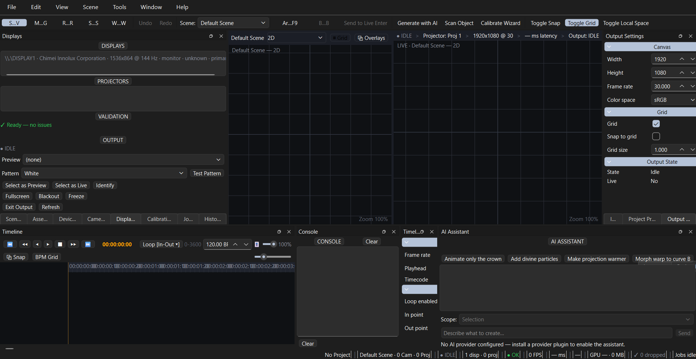
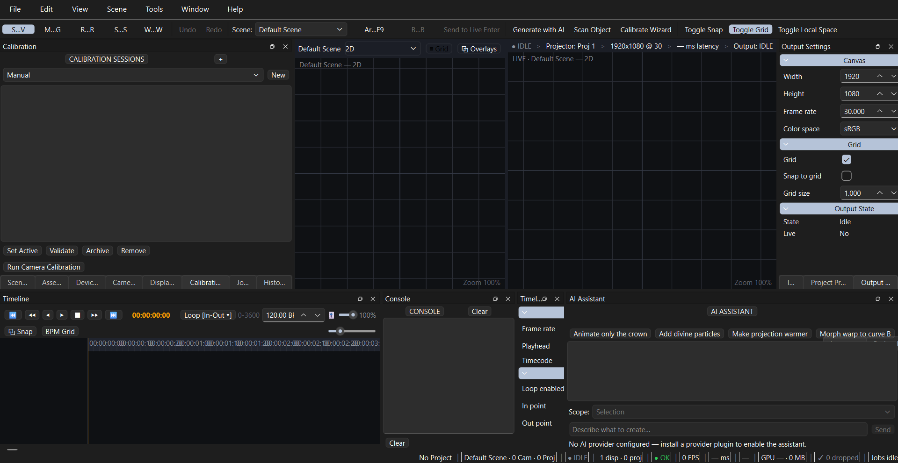

# ProjectionAI

A PySide6 desktop application for camera-projector calibration, content warping, and safe live projection output.

[](https://github.com/sashtriyasam/projectionai/actions/workflows/ci.yml)
[](https://www.python.org/)
[](https://mypy-lang.org/)
[](LICENSE)

ProjectionAI takes a camera and a projector, computes the geometric mapping between them, and warps content so it lands correctly on a physical surface. AI content generation is available as an optional add-on; every core feature runs offline.

---

## Screenshot



The desktop shell with docked panels, 3D viewport, and hardware status bar.

### Gallery

|                                                            |                                                               |
| ---------------------------------------------------------- | ------------------------------------------------------------- |
|       |  |
| _Device Selection — choose camera and projector_           | _Calibration — 8-stage pipeline with validation_              |
|                |               |
| _Displays — display detection, validation gates, arm/live_ | _Output Settings — canvas, grid, warp preview_                |

---

## What ProjectionAI Does

- **Calibrate** — run a camera and projector through a structured-light calibration pipeline to estimate how projected pixels map onto the target surface.
- **Warp** — transform content through that mapping so it appears geometrically correct when projected onto the real surface.
- **Project** — preview the warped result, pass automated validation gates, arm the output session, and go live under explicit operator control.
- **Generate content (optional)** — a provider-agnostic AI engine (Gemini, OpenAI, Anthropic, Replicate) can generate content from natural language prompts when an API key is configured. Calibration, warping, display output, and the 3D viewport all work fully offline without any AI provider.

---

## Core Workflow

The operational path from hardware selection to live output:

1. **Select devices** — choose the camera and projector from the detected hardware list.
2. **Configure projection surface** — define the geometry of the surface being projected onto.
3. **Run calibration pipeline** — capture structured-light patterns and compute the camera-to-projector mapping.
4. **Review calibration result** — inspect the estimated mapping and its quality metrics before relying on it.
5. **Preview warped output** — render content through the warp in a safe preview window.
6. **Validate safety gates** — automatic checks must pass before live output becomes available.
7. **Arm output** — prepare the live session; arming alone sends nothing to the projector.
8. **Go live** — an explicit operator button press starts sending frames to the projector.
9. **Runtime watchdog monitors output** — continuous checks detect failures during the live session.

---

## Safety Model

ProjectionAI treats preparing output and sending output to a projector as two distinct, deliberately separated states.

- **ARM is not LIVE.** Arming prepares the output session only. No frames reach the projector until the operator explicitly triggers GO LIVE.
- **Validation gates must pass first.** All gates must be green before LIVE becomes reachable.
- **GO LIVE requires explicit operator intent.** Starting output is always a deliberate button press, never a side effect of another action.
- **Runtime watchdog.** Active output is monitored continuously. A failed output transitions safely to blackout instead of leaving a stale image on the surface.
- **Physical hardware validation is still pending.** Gates H-01 through H-07, which exercise a real camera, projector, and projection surface, have not been executed yet. See the status dashboard below and [docs/HARDWARE-VALIDATION.md](docs/HARDWARE-VALIDATION.md).

---

## Current Status

```
Software implementation       ✅
Automated testing (2,194+)    ✅
CI pipeline                   ✅
End-to-end software flow      ✅
Physical calibration          ⏳ pending
Hardware gates H-01..H-07     ⏳ pending
```

The software is complete and verified against deterministic mock providers. Physical calibration on real hardware has not been performed, so the system is not yet validated for real-world projection work.

---

## Quick Start

```bash
# Prerequisites: Python 3.12+, uv
git clone https://github.com/sashtriyasam/projectionai.git
cd projectionai

# Create virtual environment and install dependencies
uv sync

# Activate
.venv\Scripts\activate   # Windows
# source .venv/bin/activate  # macOS/Linux

# Optional: configure an AI provider for content generation
cp .env.example .env    # edit .env with your API keys

# Run
python -m projectionai   # or: uv run projectionai
```

The application runs without any AI provider configured. Content warping, calibration, display output, and the 3D viewport all work offline; a provider is only needed for AI content generation.

---

## Hardware Requirements

> Hardware gates H-01 through H-07 are **HARDWARE_PENDING**. No physical calibration session has been validated yet.

**Software-only development**

All features except physical projection work without any hardware. The calibration pipeline, warping, the 3D viewport, display topology detection, and output session management are all exercised by the test suite using deterministic mock providers.

**Physical projection calibration**

- Camera (USB)
- Projector or second display
- Flat projection surface
- Camera mount

See [docs/HARDWARE-VALIDATION.md](docs/HARDWARE-VALIDATION.md) for the validation harness and readiness checklist.

---

## Development

```bash
# Install with dev dependencies
uv sync --extra dev

# Run the full test suite
pytest

# Type check (strict)
mypy src/projectionai

# Lint and format
ruff check src/
ruff format --check src/
ruff format src/           # auto-format

# Install pre-commit hooks
pre-commit install
```

**Testing**

- Run everything: `pytest`
- Focus on one area: `pytest tests/unit/hardware`
- Coverage gate: `--cov-fail-under=60` (enforced in CI)
- Global timeout: 300s per test; hangs are killed deterministically
- Markers: `slow`, `integration`, `requires_gpu`, `requires_camera`
- UI tests run headless via `QT_QPA_PLATFORM=offscreen`

**Coding standards**

- `strict` mypy is enforced; never silence errors with `# type: ignore`
- `ruff` with `E/W/F/I/N/UP/B/SIM/ARG/RUF` rulesets (see `pyproject.toml`)
- `ruff format` (double-quoted, line length 88)
- Recoverable failures use the typed `ProjectionAIError` hierarchy; no bare `except:`
- Test-driven development with fixtures in `tests/fixtures/`, headless Qt via `offscreen`

See [CONTRIBUTING.md](CONTRIBUTING.md) for the full contributor workflow.

---

## Architecture

```
┌─────────────────────────────────────────────────────────────┐
│                          UI (PySide6)                        │
│  Views ↔ ViewModels ↔ Panels ↔ Status bar  (MVVM)            │
└───────────────┬───────────────────────────────┬──────────────┘
                │                               │
┌───────────────▼───────────────┐   ┌───────────▼──────────────┐
│         Application            │   │        managers/          │
│   use-case orchestrators       │   │ Settings · Plugin ·      │
│   (scan / generate / warp /    │   │ Command · Scene · Asset ·│
│    preview / project)          │   │ Job · Project · Hardware │
└───────────────┬───────────────┘   └───────────▲──────────────┘
                │                               │
┌───────────────▼───────────────────────────────┴──────────────┐
│                  Event Bus (typed, async)                     │
└───────────────▲───────────────────────────────┬──────────────┘
                │                               │
┌───────────────┴───────────────┐   ┌───────────▼──────────────┐
│        Domain models           │   │          Services         │
│   (pure Python, no deps)      │   │  (interfaces/Protocols)   │
└───────────────┬───────────────┘   └───────────▲──────────────┘
                │                               │
                └─────────── Infrastructure ────┘
        (AI providers · OpenCV · ModernGL · SQLite · Display)
```

- **UI (PySide6)** — Views ↔ ViewModels ↔ Panels, MVVM throughout
- **Application** — use-case orchestrators (scan, generate, warp, preview, project)
- **Domain** — pure Python models with no external dependencies
- **Services** — interfaces / Protocols consumed by the domain and application layers
- **Infrastructure** — implementations (AI providers, OpenCV, ModernGL, SQLite, display providers)
- **Canonical authorities** — ProductionWorkflow sequences operations, ValidationGate checks output safety, OutputManager owns sessions, RuntimeWatchdog monitors live output

The dependency direction is strictly one-way: `UI → Application → Domain`, with infrastructure providing the service implementations. See [docs/Architecture.md](docs/Architecture.md) for a detailed walkthrough, [docs/ADR/](docs/ADR/) for architecture decision records (12 ADRs), and [docs/UX-ARCHITECTURE.md](docs/UX-ARCHITECTURE.md) for the desktop UX design.

---

## Repository Structure

```
src/projectionai/               # Main package
├── core/                       # Framework: event bus, plugin system, config, errors, logging
├── domain/                     # Business models: scene, project, surface, calibration, assets, jobs, workspace
├── services/                   # Abstractions: vision, AI, renderer, calibration, display, storage
├── infrastructure/             # Implementations: AI providers, OpenCV, ModernGL, SQLite, display providers
├── application/                # Use cases: scan, generate, warp, preview, project
├── managers/                   # Concrete managers: scene, asset, project, job, plugin, settings, workspace, command, hardware
├── editor/                     # Editor subsystems: selection, gizmos, transform tools, camera, calibration overlay
├── calibration/                # Projector & camera calibration: stages, models, pipeline, validation, export
├── hardware/                   # Display hardware: topology, watcher, validator, output sessions
├── ui/                         # PySide6 shell: main window, panels, viewmodels, views, widgets, theme
├── app.py                      # Application bootstrap / DI container
└── main.py                     # CLI entry point
```

---

## Project Status & Roadmap

Current version: **v0.1.0.dev0**. Software development through the current baseline is complete; physical hardware validation remains pending. See [ROADMAP.md](ROADMAP.md) for milestone detail and [CHANGELOG.md](CHANGELOG.md) for release notes.

---

## Contributing

Contributions are welcome. See [CONTRIBUTING.md](CONTRIBUTING.md) for setup, code style, testing, and PR workflow, and please read the [Code of Conduct](CODE_OF_CONDUCT.md).

## Security

If you find a security vulnerability, please follow the process in [SECURITY.md](SECURITY.md) (do not open a public issue).

## License

Licensed under the [MIT License](LICENSE).
